---
## Front matter
title: "Лабораторная работа № 1"
subtitle: "Основы информационной безопасности"
author: "Перегудов Александр Вадимович"

## Generic otions
lang: ru-RU
toc-title: "Содержание"

## Bibliography
bibliography: bib/cite.bib
csl: pandoc/csl/gost-r-7-0-5-2008-numeric.csl

## Pdf output format
toc: true # Table of contents
toc-depth: 2
lof: true # List of figures
lot: true # List of tables
fontsize: 12pt
linestretch: 1.5
papersize: a4
documentclass: scrreprt
## I18n polyglossia
polyglossia-lang:
  name: russian
  options:
	- spelling=modern
	- babelshorthands=true
polyglossia-otherlangs:
  name: english
## I18n babel
babel-lang: russian
babel-otherlangs: english
## Fonts
mainfont: PT Serif
romanfont: PT Serif
sansfont: PT Sans
monofont: PT Mono
mainfontoptions: Ligatures=TeX
romanfontoptions: Ligatures=TeX
sansfontoptions: Ligatures=TeX,Scale=MatchLowercase
monofontoptions: Scale=MatchLowercase,Scale=0.9
## Biblatex
biblatex: true
biblio-style: "gost-numeric"
biblatexoptions:
  - parentracker=true
  - backend=biber
  - hyperref=auto
  - language=auto
  - autolang=other*
  - citestyle=gost-numeric
## Pandoc-crossref LaTeX customization
figureTitle: "Рис."
tableTitle: "Таблица"
listingTitle: "Листинг"
lofTitle: "Список иллюстраций"
lotTitle: "Список таблиц"
lolTitle: "Листинги"
## Misc options
indent: true
header-includes:
  - \usepackage{indentfirst}
  - \usepackage{float} # keep figures where there are in the text
  - \floatplacement{figure}{H} # keep figures where there are in the text
---

# Цель работы

Целью данной работы является приобретение практических навыков
установки операционной системы на виртуальную машину, настройки минимально необходимых для дальнейшей работы сервисов.

# Задание

# Теоретическое введение

# Выполнение лабораторной работы

Открыл VirtualBox и начинаю создавать новую виртуальную машину. (рис. @fig:001)

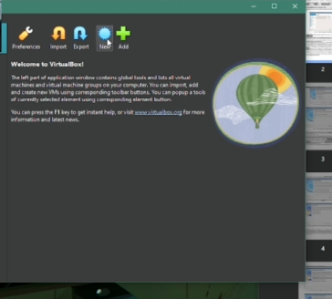{#fig:001 width=70%}

Задаю имя и образ виртуальной машины. (рис. @fig:002)

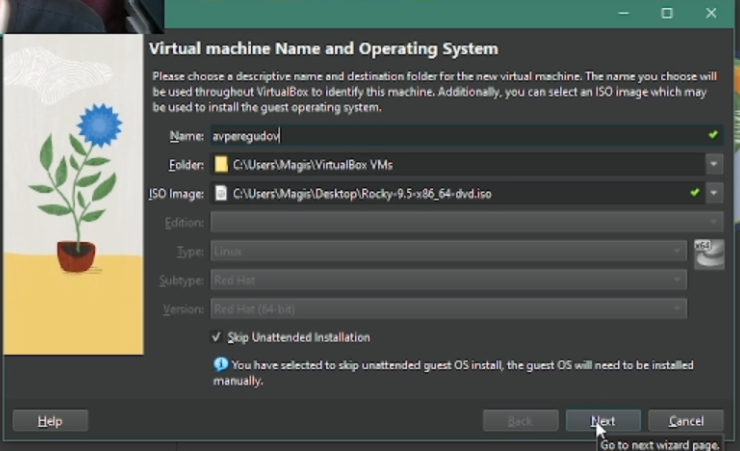{#fig:002 width=70%}

Задаю выделяюмую память и потоки. (рис. @fig:003)

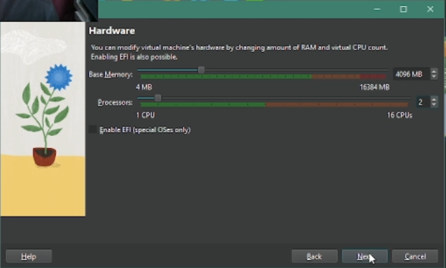{#fig:003 width=70%}

Задаю размер жёсткого диска. (рис. @fig:004)

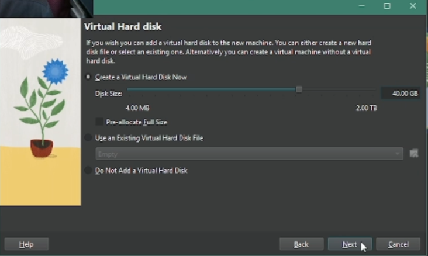{#fig:004 width=70%}

Смотрю итоги конфигурации и заканчиваю первые настройки. (рис. @fig:005)

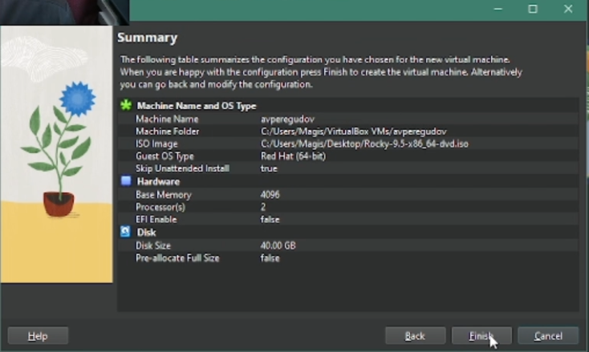{#fig:005 width=70%}

Запускаю установщик. (рис. @fig:006, @fig:007)

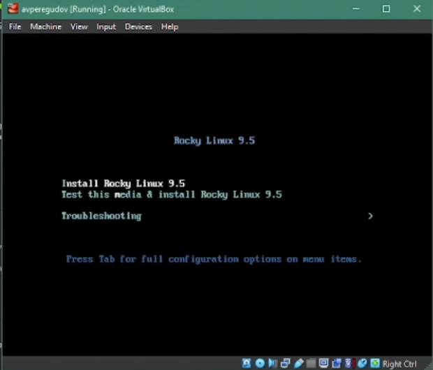{#fig:006 width=70%}

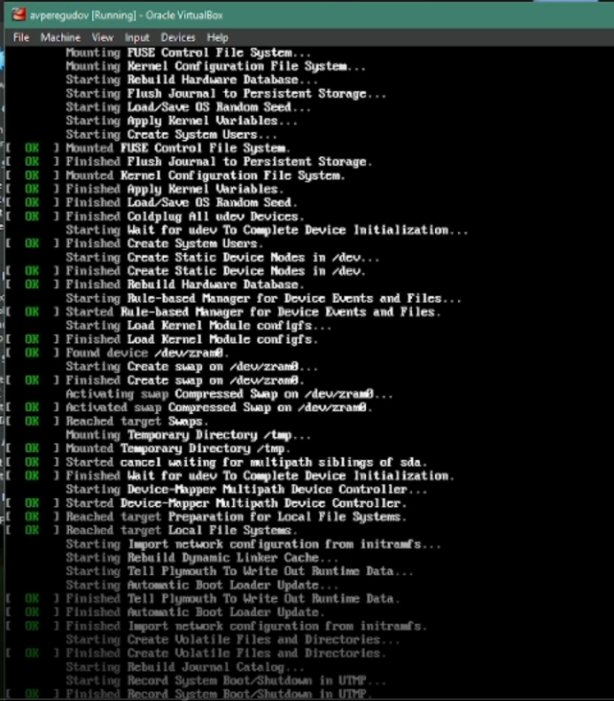{#fig:007 width=70%}

Выбираю язык. (рис. @fig:008)

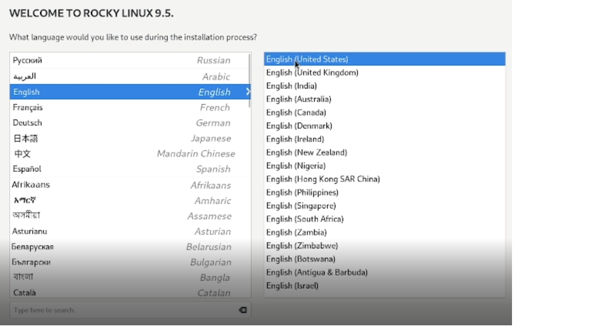{#fig:008 width=70%}

Добавляю русскую раскладку. (рис. @fig:009)

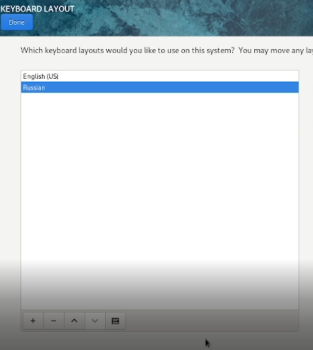{#fig:009 width=70%}

Указал комбинацию для смены раскладки. (рис. @fig:010)

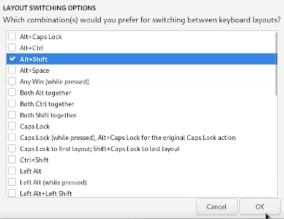{#fig:010 width=70%}

Выбрал базовое окружение и дополнительное программное обеспечение. (рис. @fig:011)

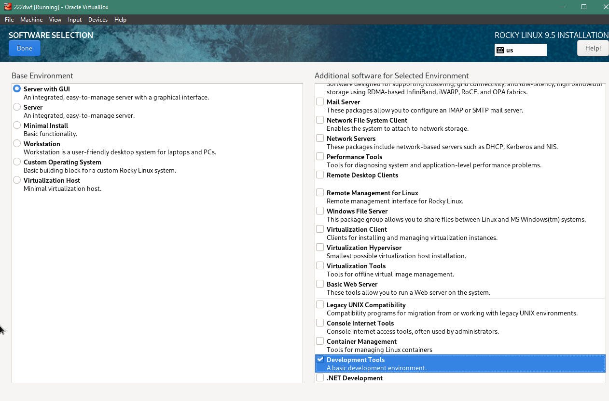{#fig:011 width=70%}

Отключил KDUMP. (рис. @fig:012)

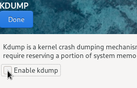{#fig:012 width=70%}

Сменил имя хоста. (рис. @fig:013)

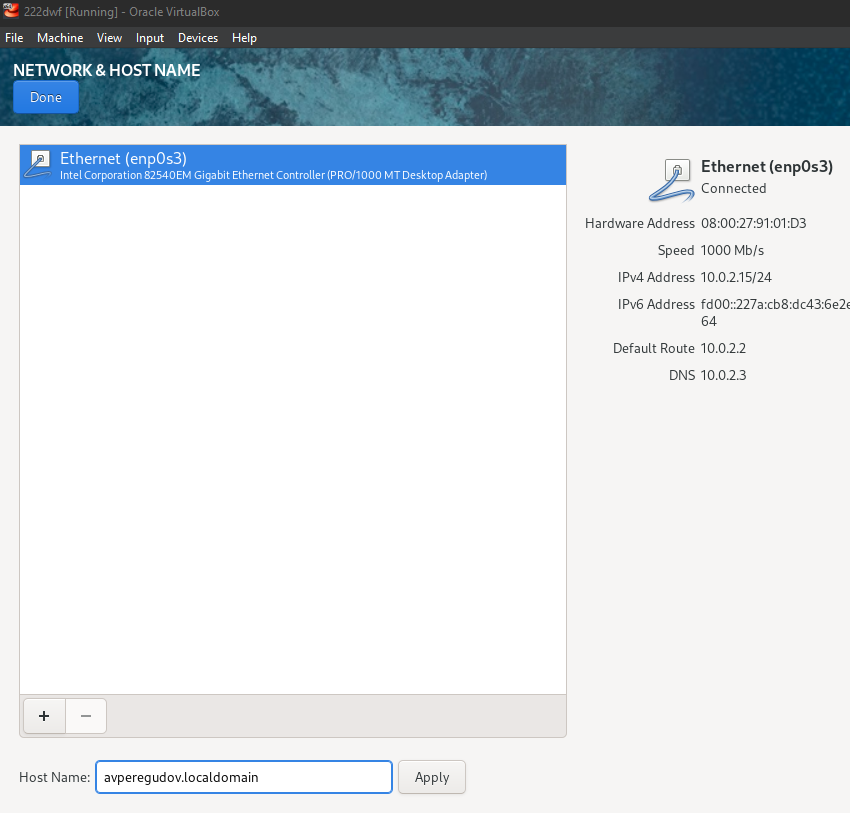{#fig:013 width=70%}

Поставил пароль для root аккаунта. (рис. @fig:014)

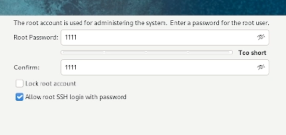{#fig:014 width=70%}

Создал учётную запись и сделал её администратором. (рис. @fig:015)

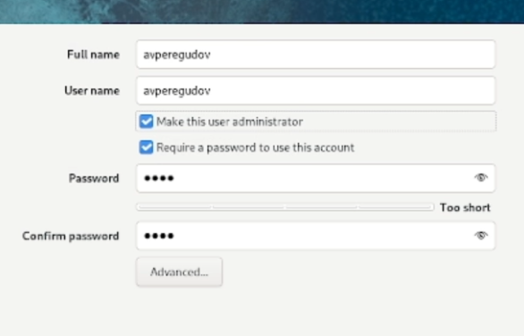{#fig:015 width=70%}

Начал установку. (рис. @fig:016)

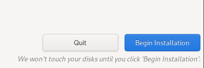{#fig:016 width=70%}

Закончил установку и перезагрузил виртуальную машину. (рис. @fig:017)

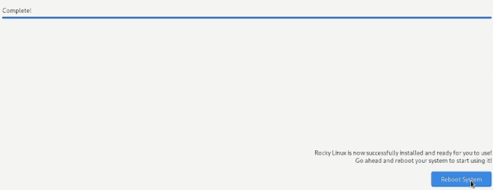{#fig:017 width=70%}

Вошёл под своей учётной записи. (рис. @fig:018)

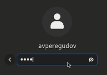{#fig:018 width=70%}

Подключил образ диска дополнений гостевой ОС. (рис. @fig:019)

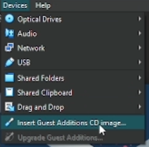{#fig:019 width=70%}

Загрузил дополнения. (рис. @fig:020, @fig:021)

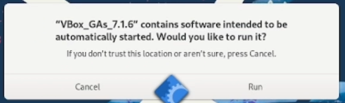{#fig:020 width=70%}

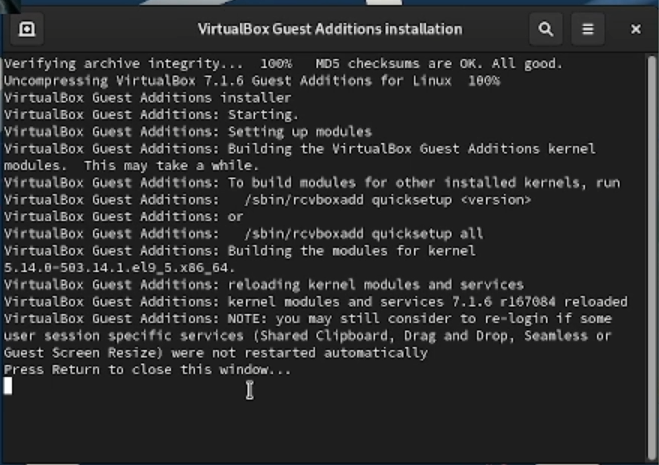{#fig:021 width=70%}

выполняю команду dmesg. (рис. @fig:022, @fig:023)

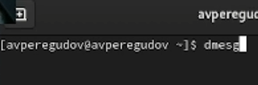{#fig:022 width=70%}

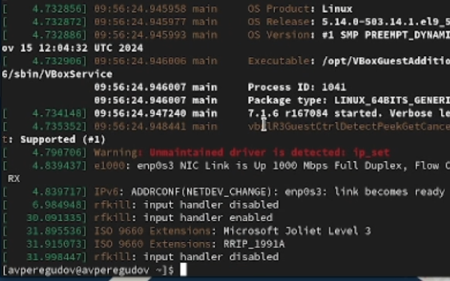{#fig:023 width=70%}

Получаю некоторую информацию с помощью dmesg | grep -i "<информация>". (рис. @fig:024)

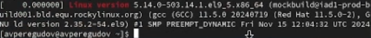{#fig:024 width=70%}

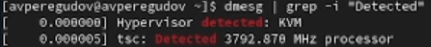{#fig:025 width=70%}

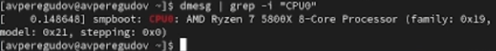{#fig:026 width=70%}

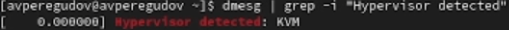{#fig:027 width=70%}

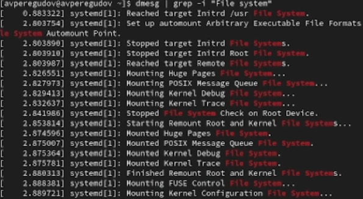{#fig:028 width=70%}

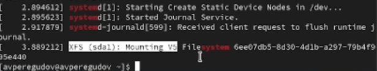{#fig:029 width=70%}

# Выводы

В данной лаборатной работе были приобретены практические навыки по установке операционной системы и настройки минимально необходимых сервисов на виртуальной машине.

# Контрольные вопросы

1. Какую информацию содержит учётная запись пользователя?

Имя пользователя
UID (уникальный идентификатор)
GID (идентификатор группы)
Домашний каталог

2. Укажите команды терминала и приведите примеры:

для получения справки по команде :
man <команда> – полное руководство 
<команда> --help – краткая справка

для перемещения по файловой системе :
cd <путь> – смена директории
cd .. – на уровень выше

для просмотра содержимого каталога :
ls – список файлов
ls -la – подробный список с правами

для определения объёма каталога : 
du -sh <каталог> – размер каталога

для создания / удаления каталогов / файлов : 
mkdir <каталог> – создать каталог
rmdir <каталог> – удалить пустой каталог
rm -r <каталог> – удалить каталог с файлами
touch <файл> – создать файл
rm <файл> – удалить файл

Задание прав на файл / каталог:
chmod 755 <файл> – задать права
chown user:group <файл> – сменить владельца

Просмотр истории команд:
history – список команд

3. Файловая система – структура для хранения и организации данных на носителе.
Примеры:

ext4 – стандартная для Linux, журналируемая
NTFS – основная для Windows, поддерживает ACL и сжатие
FAT32 – кроссплатформенная, но без поддержки больших файлов
XFS – высокопроизводительная, для больших данных

4. Как посмотреть, какие файловые системы подмонтированы?
mount – список смонтированных файловых систем
df -T – с типом файловых систем
lsblk -f – список устройств и их файловых систем

5. Как удалить зависший процесс?
kill <PID> – мягкое завершение
kill -9 <PID> – принудительное завершение
pkill <имя_процесса> – убить по имени
htop или top – интерактивное управление процессами

# Список литературы{.unnumbered}

::: {#refs}
:::
