---
## Front matter
title: "Лабораторная работа № 1"
subtitle: "Основы информационной безопасности"
author: "Перегудов Александр Вадимович"

## Generic otions
lang: ru-RU
toc-title: "Содержание"

## Bibliography
bibliography: bib/cite.bib
csl: pandoc/csl/gost-r-7-0-5-2008-numeric.csl

## Pdf output format
toc: true # Table of contents
toc-depth: 2
lof: true # List of figures
lot: true # List of tables
fontsize: 12pt
linestretch: 1.5
papersize: a4
documentclass: scrreprt
## I18n polyglossia
polyglossia-lang:
  name: russian
  options:
	- spelling=modern
	- babelshorthands=true
polyglossia-otherlangs:
  name: english
## I18n babel
babel-lang: russian
babel-otherlangs: english
## Fonts
mainfont: PT Serif
romanfont: PT Serif
sansfont: PT Sans
monofont: PT Mono
mainfontoptions: Ligatures=TeX
romanfontoptions: Ligatures=TeX
sansfontoptions: Ligatures=TeX,Scale=MatchLowercase
monofontoptions: Scale=MatchLowercase,Scale=0.9
## Biblatex
biblatex: true
biblio-style: "gost-numeric"
biblatexoptions:
  - parentracker=true
  - backend=biber
  - hyperref=auto
  - language=auto
  - autolang=other*
  - citestyle=gost-numeric
## Pandoc-crossref LaTeX customization
figureTitle: "Рис."
tableTitle: "Таблица"
listingTitle: "Листинг"
lofTitle: "Список иллюстраций"
lotTitle: "Список таблиц"
lolTitle: "Листинги"
## Misc options
indent: true
header-includes:
  - \usepackage{indentfirst}
  - \usepackage{float} # keep figures where there are in the text
  - \floatplacement{figure}{H} # keep figures where there are in the text
---

# Цель работы

Получение практических навыков работы в консоли с атрибутами файлов, закрепление теоретических основ дискреционного разграничения доступа в современных системах с открытым кодом на базе ОС Linux.

# Задание

# Теоретическое введение

# Выполнение лабораторной работы

Зашёл в учётную запись администратора и добавил нового пользователя. (рис. @fig:001)

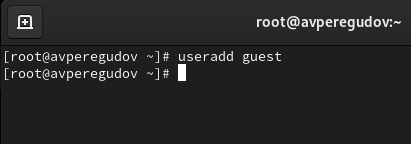{#fig:001 width=70%}

Установил пароль для guest. (рис. @fig:002)

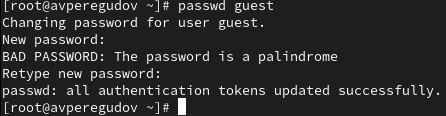{#fig:002 width=70%}

Вошёл в систему под учётной записью guest. (рис. @fig:003)

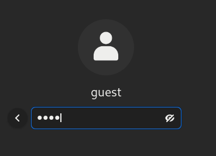{#fig:003 width=70%}

Используя команду pwd узнаю домашнюю директорию пользователя guest. (рис. @fig:004)

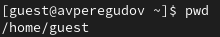{#fig:004 width=70%}

Используя команду whoami узнаю имя учётной записи. (рис. @fig:005)

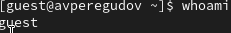{#fig:005 width=70%}

Используя команду id узнаю имя пользователя, его группу, а также группы, куда входит пользователь. Сравнил вывод id с выводом команды groups. Значения совпадают. Полученная информацию об имени пользователя совпадает с данными, выводимыми в приглашении командной строки (рис. @fig:007)

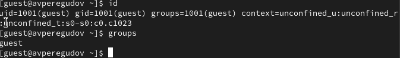{#fig:007 width=70%}

Просмотрел файл /etc/passwd командой cat /etc/passwd. (рис. @fig:008)

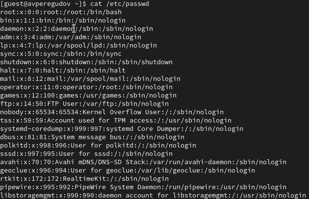{#fig:008 width=70%}

Нашёл в этом файле свою учётную запись. uid и gid пользователя совпадают с найденными значениями полученными в предыдущих пунктах. (рис. @fig:009)

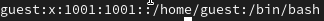{#fig:009 width=70%}

Определил существующие в системе директории командой. Поддиректории директори home получить удалось. На поддиректориях установлены права на чтение, запись, и исполнение файлов. (рис. @fig:010)

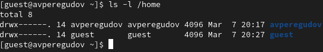{#fig:010 width=70%}

Провил какие расширенные атрибуты установлены на поддиректориях, находящихся в директории /home, командой lsattr /home. Увидеть расширенные атрибуты директории не удалось. Увидеть расширенные атрибуты директорий других
пользователей не удалось. Нет соостветсвующих прав (рис. @fig:011)

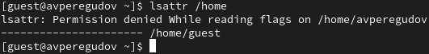{#fig:011 width=70%}

Создал в домашней директории поддиректорию dir1 командой mkdir dir1
Определил командами ls -l и lsattr. Были установлены права доступа на чтение, запись, исполнение для пользователя, исполнение и чтение для группы и всех остальных. Расширенные атрибуты не выставлены. (рис. @fig:012)

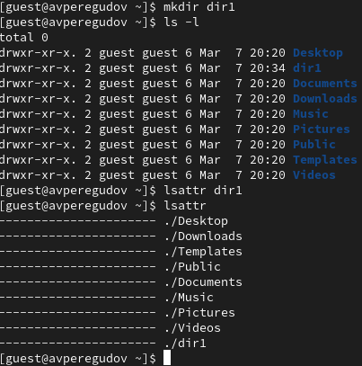{#fig:012 width=70%}

Снял с директории dir1 все атрибуты командой chmod 000 dir1 и проверил с помощью команды ls -l правильность выполнения команды. (рис. @fig:013)

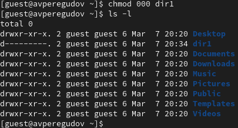{#fig:013 width=70%}

Попытался создать в директории dir1 файл file1 командой echo "test" > /home/guest/dir1/file1. Отказ произошёл потому что на прошлом шаге я изменил права на директорию dir1. У этого пользователя больше нет никаких прав для работы с этой папкой. Сообщение об ошибке отразилось на создании файла таким образом что файл вообще не создался и посмотреть что в папке с этой учётной записи не представляется возможным из отсутсвия прав на чтение. (рис. @fig:014)

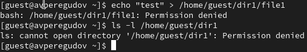{#fig:014 width=70%}

Сменил пользователя на root и посмотрел что находится в дирекотрии dir1. И вправду, файл даже не создался и его действительно нет. (рис. @fig:015)

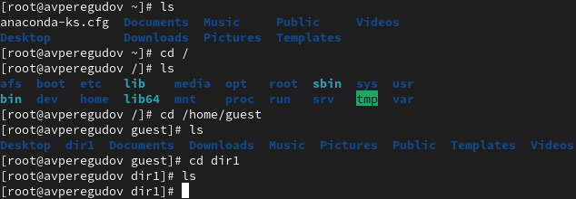{#fig:015 width=70%}

Перешёл в директорию Documents и начал проверять возможность выполнять некоторые команды от имени владельца директории. (рис. @fig:016, @fig:017)

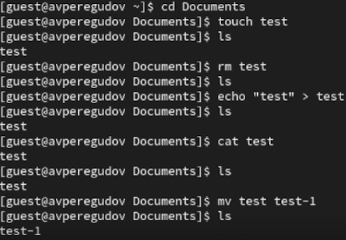{#fig:016 width=70%}

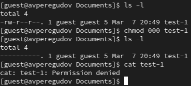{#fig:017 width=70%}

# Выводы

В этой лабороторной работе были получены практические навыки работы в консоли с атрибутами файлов и закреплены теоретические основы дискреционного разграничения доступа в современных системах с открытым кодом на базе ОС Linux.

# Таблицы

Здесь будет две таблицы которые мне нужно было заполнить. Правда они в виде строк и только тех строк которые нужно было заполнить.

Первая таблица

Права директории Documents для владельца: rw?. Для определения исполнения нужно попытаться запустить программу в этой директории, но такого задания не было поэтому нельзя сказать без ls -l что-то про x.

Права файла: rw?.

Создание файла: +

Удаление файла: +

Запись в файл: +

Чтение файла: +

Смена директории: +

Просмотр файлов в директории: +

Переименование файла: +

Смена атрибутов файла: +

Вторая таблица

Операция        Минимальные права на директорию  Минимальные права на файл

Создание файла:                  -w-              Файла ещё не существует
Удаление файла:                  -w-                        -w-
Чтение файла:                    r--                        r--
Запись в файл:                   -w-                        -w-
Переименование файла:            -w-                        -w-
Создание поддиректории:          -w-                        ---
Удаление поддиректории:          -w-                        ---

# Список литературы{.unnumbered}

::: {#refs}
:::
