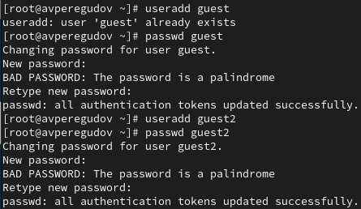
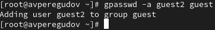
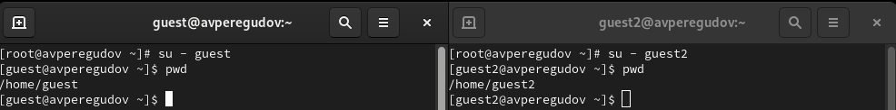
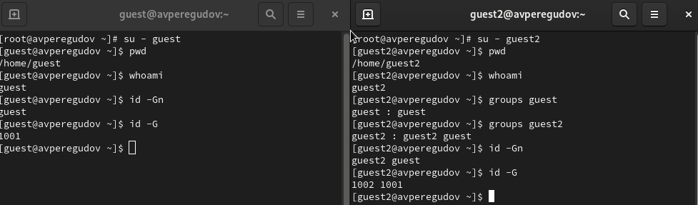
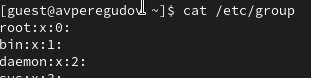
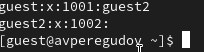
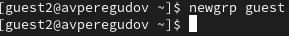
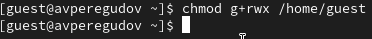
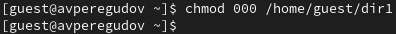
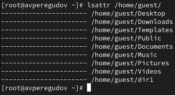

---
## Front matter
title: "Лабораторная работа № 3"
subtitle: "Основы информационной безопасности"
author: "Перегудов Александр Вадимович"

## Generic otions
lang: ru-RU
toc-title: "Содержание"

## Bibliography
bibliography: bib/cite.bib
csl: pandoc/csl/gost-r-7-0-5-2008-numeric.csl

## Pdf output format
toc: true # Table of contents
toc-depth: 2
lof: true # List of figures
lot: true # List of tables
fontsize: 12pt
linestretch: 1.5
papersize: a4
documentclass: scrreprt
## I18n polyglossia
polyglossia-lang:
  name: russian
  options:
	- spelling=modern
	- babelshorthands=true
polyglossia-otherlangs:
  name: english
## I18n babel
babel-lang: russian
babel-otherlangs: english
## Fonts
mainfont: PT Serif
romanfont: PT Serif
sansfont: PT Sans
monofont: PT Mono
mainfontoptions: Ligatures=TeX
romanfontoptions: Ligatures=TeX
sansfontoptions: Ligatures=TeX,Scale=MatchLowercase
monofontoptions: Scale=MatchLowercase,Scale=0.9
## Biblatex
biblatex: true
biblio-style: "gost-numeric"
biblatexoptions:
  - parentracker=true
  - backend=biber
  - hyperref=auto
  - language=auto
  - autolang=other*
  - citestyle=gost-numeric
## Pandoc-crossref LaTeX customization
figureTitle: "Рис."
tableTitle: "Таблица"
listingTitle: "Листинг"
lofTitle: "Список иллюстраций"
lotTitle: "Список таблиц"
lolTitle: "Листинги"
## Misc options
indent: true
header-includes:
  - \usepackage{indentfirst}
  - \usepackage{float} # keep figures where there are in the text
  - \floatplacement{figure}{H} # keep figures where there are in the text
---

# Цель работы

Получение практических навыков работы в консоли с атрибутами файлов для групп пользователей.

# Задание

# Теоретическое введение

# Выполнение лабораторной работы

Создал двух пользователей и задал им пароли. (рис. @fig:001)

{#fig:001 width=70%}

Добавил пользователя guest2 в группу guest. (рис. @fig:002)

{#fig:002 width=70%}

Осуществил вход в систему от двух пользователей на двух разных консолях и определил директории в которых находятся пользователи. (рис. @fig:004)

{#fig:004 width=70%}

Уточнил имя пользователей, группы, кто входит в них
и к каким группам принадлежат пользователи. (рис. @fig:005)

{#fig:005 width=70%}

Просмотрел файл /etc/group командой cat. (рис. @fig:006, @fig:007)

{#fig:006 width=70%}

{#fig:007 width=70%}

От имени пользователя guest2 выполнил регистрацию пользователя
guest2 в группе guest. (рис. @fig:008)

{#fig:008 width=70%}

От имени пользователя guest изменил права директории /home/guest,
разрешив все действия для пользователей группы. (рис. @fig:009)

{#fig:009 width=70%}

От имени пользователя guest снял с директории /home/guest/dir1
все атрибуты (рис. @fig:010, @fig:011)

{#fig:010 width=70%}

{#fig:011 width=70%}

# Выводы

Были получены практическе навыки работы в консоли с атрибутами файлов для групп пользователей.

# Таблицы

Здесь будет две таблицы которые мне нужно было заполнить. Правда они в виде строк и только тех строк которые нужно было заполнить.

Первая таблица

Права директории Documents для владельца: rw?. Для определения исполнения нужно попытаться запустить программу в этой директории, но такого задания не было поэтому нельзя сказать без ls -l что-то про x.

Права файла: rw?.

Создание файла: +

Удаление файла: +

Запись в файл: +

Чтение файла: +

Смена директории: +

Просмотр файлов в директории: +

Переименование файла: +

Смена атрибутов файла: +

Вторая таблица

Операция        Минимальные права на директорию  Минимальные права на файл

Создание файла:                  -w-              Файла ещё не существует
Удаление файла:                  -w-                        -w-
Чтение файла:                    r--                        r--
Запись в файл:                   -w-                        -w-
Переименование файла:            -w-                        -w-
Создание поддиректории:          -w-                        ---
Удаление поддиректории:          -w-                        ---

# Список литературы{.unnumbered}

::: {#refs}
:::
