---
## Front matter
title: "Лабораторная работа № 4"
subtitle: "Основы информационной безопасности"
author: "Перегудов Александр Вадимович"

## Generic otions
lang: ru-RU
toc-title: "Содержание"

## Bibliography
bibliography: bib/cite.bib
csl: pandoc/csl/gost-r-7-0-5-2008-numeric.csl

## Pdf output format
toc: true # Table of contents
toc-depth: 2
lof: true # List of figures
lot: true # List of tables
fontsize: 12pt
linestretch: 1.5
papersize: a4
documentclass: scrreprt
## I18n polyglossia
polyglossia-lang:
  name: russian
  options:
	- spelling=modern
	- babelshorthands=true
polyglossia-otherlangs:
  name: english
## I18n babel
babel-lang: russian
babel-otherlangs: english
## Fonts
mainfont: PT Serif
romanfont: PT Serif
sansfont: PT Sans
monofont: PT Mono
mainfontoptions: Ligatures=TeX
romanfontoptions: Ligatures=TeX
sansfontoptions: Ligatures=TeX,Scale=MatchLowercase
monofontoptions: Scale=MatchLowercase,Scale=0.9
## Biblatex
biblatex: true
biblio-style: "gost-numeric"
biblatexoptions:
  - parentracker=true
  - backend=biber
  - hyperref=auto
  - language=auto
  - autolang=other*
  - citestyle=gost-numeric
## Pandoc-crossref LaTeX customization
figureTitle: "Рис."
tableTitle: "Таблица"
listingTitle: "Листинг"
lofTitle: "Список иллюстраций"
lotTitle: "Список таблиц"
lolTitle: "Листинги"
## Misc options
indent: true
header-includes:
  - \usepackage{indentfirst}
  - \usepackage{float} # keep figures where there are in the text
  - \floatplacement{figure}{H} # keep figures where there are in the text
---

# Цель работы

Получение практических навыков работы в консоли с расширенными
атрибутами файлов.

# Задание

# Теоретическое введение

# Выполнение лабораторной работы

Перешёл в домашнию директорию пользователя guest. И от имени пользователя guest определит расширенные атрибуты файла file1. (рис. @fig:001)

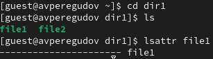{#fig:001 width=70%}

Установил командой chmod 600 file1 на файл file1 права, разрешающие чтение и запись для владельца файла. (рис. @fig:002)

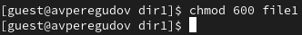{#fig:002 width=70%}

Попробовал установить на файл /home/guest/dir1/file1 расширенный атрибут a от имени пользователя guest. В ответ получил отказ на выполнения операции. (рис. @fig:003)

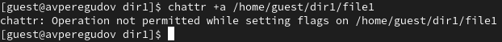{#fig:003 width=70%}

Открыл вторую консоль, повысил права и перешёл в /home/guest/dir1. (рис. @fig:004)

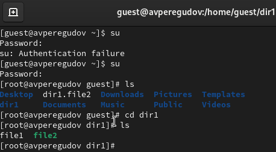{#fig:004 width=70%}

Попробовал установить на файл /home/guest/dir1/file1 расширенный атрибут a с правами суперпользователя. (рис. @fig:005)

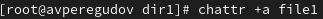{#fig:005 width=70%}

От пользователя guest проверил правильность установления атрибута (рис. @fig:006)

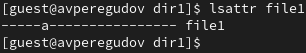{#fig:006 width=70%}

Выполнил дозапись в файл и проверил эту дозапись. (рис. @fig:007)

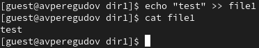{#fig:007 width=70%}

Попробовал некоторые команды (рис. @fig:009)

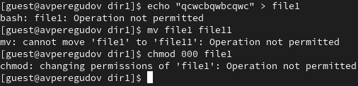{#fig:009 width=70%}

Снял расширенный атрибут a с файла /home/guest/dirl/file1 от
имени суперпользователя командой (рис. @fig:011)

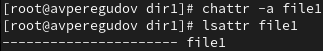{#fig:011 width=70%}

Попробовал некоторые команды. В этот раз без атрибутап они сработали (рис. @fig:012)

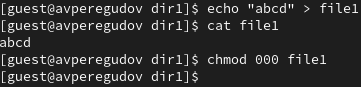{#fig:012 width=70%}

Попробовал установить на файл /home/guest/dir1/file1 расширенный атрибут i с правами суперпользователя. (рис. @fig:013)

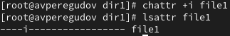{#fig:013 width=70%}

Попробовал некоторые команды (рис. @fig:014)

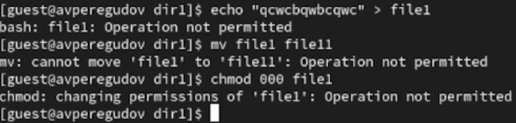{#fig:014 width=70%}

# Выводы

В результате выполнения работы повысились навыки использования интерфейса командой строки (CLI), познакомился на примерах с тем,
как используются основные и расширенные атрибуты при разграничении
доступа. Связал теорию дискреционного разделения доступа (дискреционная политика безопасности) с её реализацией на практике в ОС Linux. Составил наглядные таблицы, поясняющие какие операции возможны при тех или иных установленных правах. Опробовал действие на практике расширенных атрибутов «а» и «i».

# Список литературы{.unnumbered}

::: {#refs}
:::
